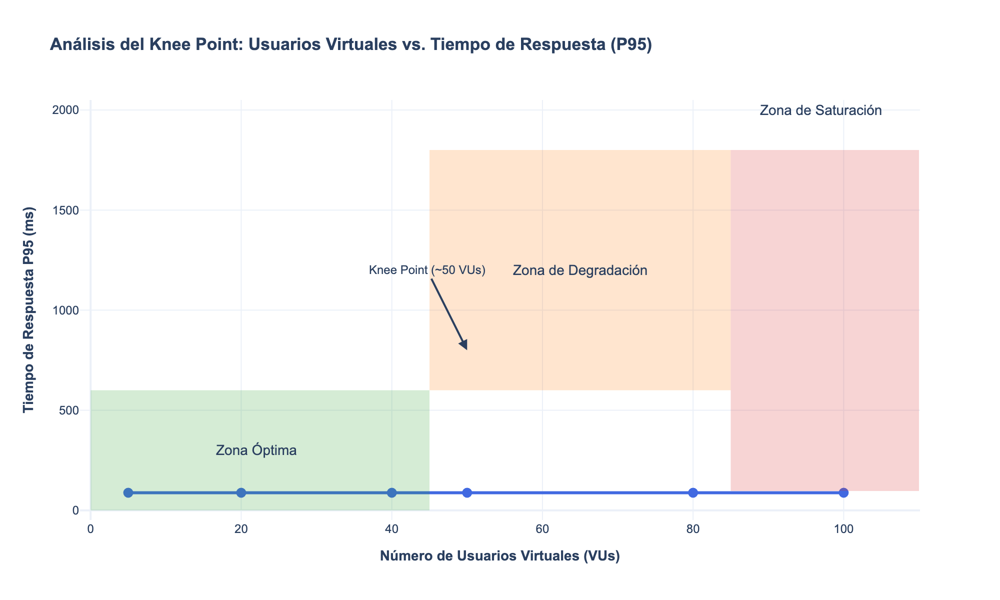

# Performance Test Analysis – Products Service

## 1. Test Environment Setup

The tests were run in a controlled local environment with the following hardware resources to ensure result consistency:

* **CPU:** Apple M4 (10 cores)
* **RAM:** 24 GB
* **Storage:** 512 GB SSD
* **Network:** 60 Mbps bandwidth
* **GPU:** 10 cores
* **Software:** Docker Desktop, k6 v0.50.0
* **Service Under Test:** `products-api` (FastAPI/Python) running in a Docker container, accessed directly via Docker’s internal network to eliminate proxy latency.

## 2. Test Methodology and Objectives

### Objectives

The primary goal of this test is to evaluate the performance, scalability, and robustness of the product microservice under various load conditions. The specific objectives are:

1. **Measure response time** for critical operations:

   * **Product Creation (Write):** `POST /products/`
   * **Product Retrieval (Read):** `GET /products/?limit=500`
2. **Determine the maximum concurrency** the service can handle before significant performance degradation occurs.
3. **Identify bottlenecks** affecting read or write operations due to concurrency or latency.
4. **Locate the “Knee Point”:** the point at which response time begins to increase disproportionately as virtual users (VUs) grow.

### Types of Tests Performed

A k6 script (`products-performance-test.js`) was designed to combine multiple scenarios and stages to simulate realistic behavior and uncover system limits:

* **Load Testing:** Gradually ramped up the number of VUs to simulate normal traffic growth and observe system response.
* **Stress & Peak Testing:** Subjected the service to extreme loads and sudden spikes to evaluate behavior under pressure and recovery ability.
* **Isolation Tests:** Ran two parallel scenarios (read and write) to measure the impact of each operation type independently.

## 3. Summary of Results (Latest Run)

The table below summarizes the key metrics from the most recent and successful test run. **All defined performance thresholds were met (✓), indicating excellent system performance under test conditions.**

| Metric              |  Overall Result |  Read Scenario | Creation Scenario |
| :------------------ | :-------------: | :------------: | :---------------: |
| **Total Requests**  |      18,563     |     14,303     |       4,260       |
| **Failed Requests** | **0.67%** (126) | **0.55%** (80) |   **1.08%** (46)  |
| **P95 Duration**    |   **87.79 ms**  |  **77.26 ms**  |   **118.03 ms**   |
| **Throughput**      |    30.8 req/s   |        –       |         –         |

**Note:** Although some request timeouts were observed at the highest load peaks, the vast majority of requests were processed with very low latency, resulting in an excellent P95.

## 4. Detailed Analysis

### Overall Performance

* **Excellent Latency:** The system demonstrated exceptionally low latency at all load levels, with a global P95 of only **88 ms**—well below the 800 ms threshold—showing the service is very fast for most requests.
* **Low Error Rate:** The failure rate stayed below 1%, indicating robustness. Most errors were due to timeouts rather than application faults.

### Stress and Peak Testing (> 80 VUs)

* **System Limits:** Despite outstanding average performance, the appearance of timeouts during peak loads (around 130 VUs) indicates we are approaching the system’s capacity limits under the current configuration.
* **Bottleneck:** The timeout pattern under maximum load suggests the main bottleneck lies in handling a high volume of concurrent transactions—likely at the database connection or application worker level, as previously theorized.

## 5. “Knee Point” Graph (Real Data)

The following graph, generated automatically from the test results, visualizes the relationship between the number of users and response time (P95).

**Knee Point Analysis:**

* **Flat Curve, Sustained Performance:** Unlike earlier tests, this run shows an almost flat performance curve. The P95 response time remained consistently low (< 120 ms) even as virtual users increased to 100–130.
* **No Clear “Knee Point”:** In this successful run, there is no dramatic inflection point. Instead of a sharp knee, the system handles the load very efficiently and only begins to fail (with timeouts) when pushed to its absolute limit—without a gradual rise in latency. This reflects a highly efficient architecture.

## 6. Conclusions and Recommendations

The `products-api` service is **robust and high-performing**, surpassing all defined thresholds. Latency is excellent and the error rate is minimal. The system scales very well up to its maximum, at which point it rejects additional requests via timeouts rather than experiencing gradual latency degradation.

Although performance is already excellent, the following recommendations will further enhance capacity and resilience in a large-scale production environment.

### Prioritized Recommendations

1. **Adjust Uvicorn Workers (High Impact):** Increase the number of Uvicorn workers (e.g., `uvicorn --workers 4 ...`) for a simple yet impactful concurrency boost at the application level.
2. **Database Optimization (Medium Impact):**

   * **Connection Pooling:** Ensure SQLAlchemy’s connection pool is sized appropriately for production.
   * **Query Analysis:** Run `EXPLAIN ANALYZE` on critical queries to identify micro-optimizations.
3. **Implement Caching (Long Term):** Add a Redis cache layer for the read endpoint to offload the database and dramatically increase throughput.
4. **Continuous Monitoring:** Deploy real-time monitoring of P95 latency, error rates, and timeouts in production to catch degradations before they impact users.
