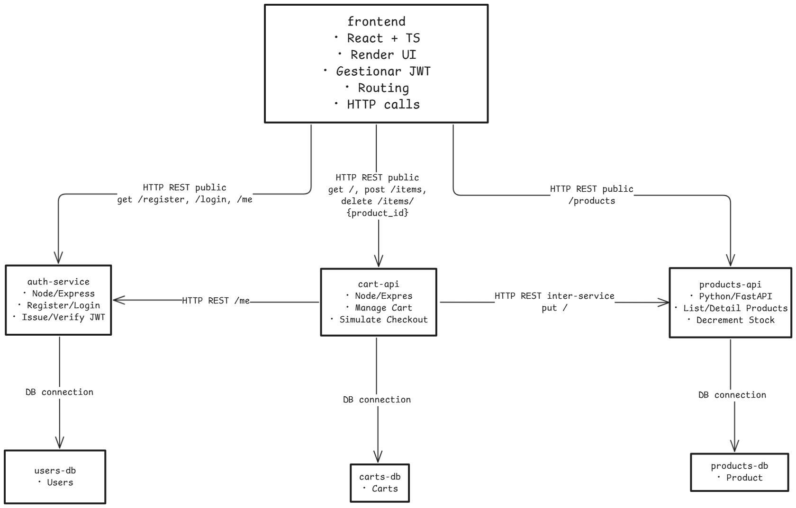

# Artifact

## 1. Team

**Name:** 1a  

**Team Members:**
- Xamir Ernesto Rojas Gamboa
- Juan Sebastian Medina Pinto
- Juan Manuel Pérez Ordoñez

## 2. Software System

**Name:** Tussi

**Logo:**


## Description

**Tussi** is an ecommerce platform built upon a distributed, modern architecture, connecting buyers and sellers in a highly scalable, modular, and secure environment. It includes decoupled microservices for authentication, product catalog management, and shopping cart management, backed by PostgreSQL and MongoDB databases.

The platform features two distinct clients:
- A full-featured **web application** built with Next.js.
- A lightweight **native mobile application** for iOS and Android built with React Native (Expo) for a streamlined product stock browsing experience.

### Prototype Objective

The first deliverable demonstrates a functional vertical flow, covering:

- User registration and login (auth-service with FastAPI and JWT)
- Product catalog viewing (service with FastAPI and PostgreSQL)
- Adding products to cart and checkout (cart-service with Express and MongoDB)

Each service is developed, documented, and containerized with Docker, orchestrated by Docker Compose, adhering to maintainability, scalability, and portability.

### Justification for Tussi's Name and Design

The name **Tussi** is intentionally provocative and disruptive—a metaphor to positively alter shopping experiences, creating emotional, sensory, and memorable interactions.

#### Aesthetic and Visual Symbolism

Intense pink color, animations, and "psychoactive" effects are deliberate emotional design choices, creating sensory engagement and visual differentiation.

#### Target Audience

**Tussi** targets young adults interested in:
- Unconventional wellness (CBD, legal nootropics, holistic products)
- Sustainable and disruptive fashion
- Digital art and sensory items

It appeals to conscious, curious, and creative consumers seeking authentic, unique experiences.

#### Value Proposition and Innovation

Tussi integrates:
- **Curated products** (sustainable, original, safe)
- **Radical transparency** (product origins, benefits, real effects)
- **Community elements** (experiential reviews, forums, direct feedback)

#### Strategic Benefits

The provocative name and design generate immediate impact and memorability, facilitating virality and differentiation, reducing market entry barriers, and establishing emotional connections from first contact.

## 3. Architectural Structures

### Component-and-Connector (C&C) Structure

#### C&C View


**Architectural Styles:**

1. **Microservices**  
   Independently deployable services like auth-service and products-api, each with isolated logic, databases, and Docker containers.  
   **Advantages:** Parallel teamwork, simplified maintenance, and horizontal scalability.

2. **Container-based Architecture**  
   All system components (services, databases) run in Docker containers orchestrated by Docker Compose.  
   **Advantages:** Consistent environments, simplified deployment, dependency isolation.

3. **Client-Server Architecture**  
   Frontend (Next.js with React-TS) acts as client, consuming backend microservices via HTTP.  
   **Advantages:** Clear separation of presentation and business logic, standard HTTP/REST interaction.

4. **Layered Architecture**  
   Each microservice internally structured into defined layers: Controllers (API), Services (business logic), Models/Schemas (data), Repository/DB (persistence).  
   **Advantages:** Easy unit testing, clear separation of concerns, improved maintainability.

### Architectural Elements and Relations

## Connectors and Protocols

- **REST-HTTP/JSON (TLS + JWT)**
  - **Web Client → Auth Service**  
    - Endpoints: `POST /auth/register`, `POST /auth/login`, `GET /auth/me`  
    - *Auth Service*: Microservicio en Python + FastAPI que gestiona registro, emisión y validación de JWT, y recuperación de perfil.
  - **Web Client → Products API**  
    - Endpoints: `GET /products`, `GET /products/{id}`  
    - *Products API*: Microservicio en Python + FastAPI para CRUD y consultas de catálogo.
  - **Web Client → Cart Service**  
    - Endpoints: `GET /cart`, `POST /cart/add`, `POST /cart/checkout`  
    - *Cart Service*: Microservicio en Node.js + Express que administra el carrito y el flujo de checkout simulado.

- **SQL (TCP / 5432)**
  - **Auth Service → auth-db (PostgreSQL)**  
    - Persistencia de usuarios, contraseñas hasheadas, roles y auditoría.
  - **Products API → products-db (PostgreSQL)**  
    - Almacenamiento relacional de productos, inventario e imágenes.

- **MongoDB Driver (TCP / 27017)**
  - **Cart Service → MongoDB**  
    - Documentos de carrito `{ userId, items: [{ productId, quantity }] }` para esquemas flexibles y operaciones frecuentes.

- **Internal REST (JSON + JWT)**
  - **Cart Service → Auth Service**  
    - Validación de la validez del JWT y autorización de usuario antes del checkout.
  - **Cart Service → Products API**  
    - Decremento de stock tras checkout exitoso para mantener consistencia de inventario.

## Critical Flows

1. **Authentication**  
   El Web Client envía credenciales al Auth Service, que valida la contraseña, genera un JWT firmado y lo devuelve.  
   El cliente incluye el JWT en el header `Authorization: Bearer <token>` de todas las llamadas protegidas.

2. **Session Validation**  
   El cliente hace `GET /auth/me` al Auth Service usando el JWT para obtener datos del perfil (ID, email, roles, preferencias).

3. **Product Catalog**  
   El cliente solicita `GET /products` o `GET /products/{id}` al Products API, que consulta PostgreSQL y retorna la información en JSON.

4. **Cart Management & Checkout**  
   - El cliente añade/elimina ítems mediante llamadas al Cart Service, que actualiza documentos en MongoDB.  
   - En `POST /cart/checkout`, el Cart Service:
     1. Valida el JWT con el Auth Service.
     2. Verifica stock via llamada interna al Products API.
     3. Simula pago (mock).
     4. Si el pago es exitoso, actualiza MongoDB y llama al Products API para decrementar el stock.

> **Nota**: Todas las conexiones REST usan TLS para cifrado y JWT para autenticación, asegurando confidencialidad e integridad de los datos.

## 4. Prototype

### Instructions for Deploying the Software System Locally

The Tussi platform consists of a backend infrastructure (services and databases) and two separate frontends (a web app and a mobile app).

#### Running the Backend Services

The backend services are orchestrated with Docker Compose. This is the foundation for both the web and mobile applications.

**Run Command:**
```bash
docker compose up --build
```
This command will build and start all the necessary services (auth, products, cart) and their databases.

#### Running the Web Application

The web frontend is also started via Docker Compose as part of the command above. It is accessible through your browser at:
```
http://localhost:3000/
```

#### Running the Mobile Application

The mobile app runs as a separate process on your local machine and connects to the same Docker-based backend.

1.  **Ensure the backend is running** using the `docker compose up --build` command above.
2.  Navigate to the mobile app's directory in a separate terminal:
    ```bash
    cd tussi-mobile
    ```
3.  For detailed instructions on running the mobile app on a simulator or physical device, please refer to the dedicated README inside its directory:
    - **[`tussi-mobile/README.md`](./tussi-mobile/README.md)**

**Populating the Database:**
Copy and run queries from `products_dump.sql` to populate the database with sample products.
